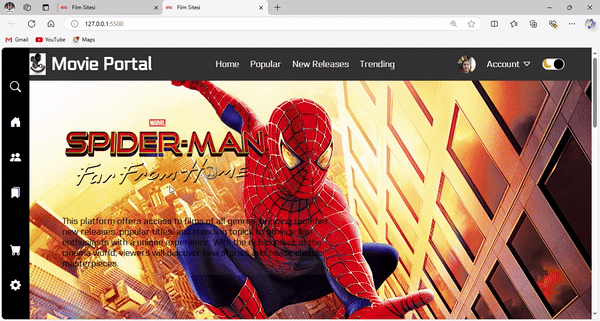

# 🎬 Movie Portal

## 🔍 Preview




**Movie Portal** is a web-based platform that allows users to explore the latest movies, popular films, and trending releases. This project uses modern web technologies to create an interactive and responsive movie browsing experience.


## ✨ Features

- **Responsive Navbar**: Includes logo and menu items for easy navigation.
- **Movie Listing**: Showcases featured categories for an organized viewing experience.
- **Profile Section**: Toggle for light/dark mode for personalized user interface.
- **Movie Filters**: Easily filter movies by categories such as "Popular", "New Releases", and "Trending".
- **Social Media Links**: Footer includes links with engaging hover effects.

## 🛠️ Technologies Used

- **HTML5**: For structuring the web pages.
- **CSS3**: For styling and layout.
- **Bootstrap**: For responsive design and layout structure.
- **JavaScript**: For interactive elements and dynamic functionality.

## 🚀 Installation

To run this project locally, follow these steps:

1. **Clone the Repository**:
   ```bash
   git clone https://github.com/yasin-erkan/movie-portal.git

2.## Open the Index File:
 Open index.html in your web browser to view the application.

🌟 Future Improvements
User Authentication: Implement user login for personalized movie recommendations.
Rating System: Allow users to rate and review movies.
Search Functionality: Add a search bar for quick access to specific films.
🤝 Contributing
Contributions are welcome! Feel free to fork this repository and submit pull requests for any enhancements or new features.

📬 Contact
For any questions or feedback, please reach out:

Yasin ERKAN
Email: yasintahaerkan@gmail.com

Thank you for checking out Movie Portal! We hope you enjoy your movie browsing experience! 🍿
